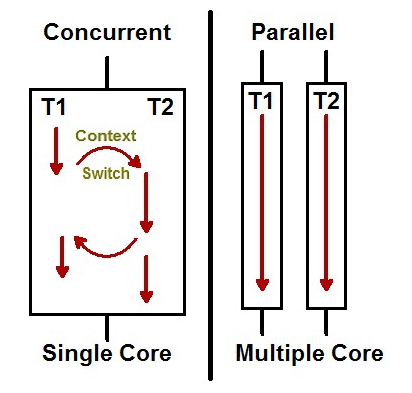

# Concurrency & Parallelism

## Concurrency

- 동시성(병행성), 독릭접인 실행 프로세스의 조합
- 여러가지 일을 한번에 처리하는 것, 구조에 관한 것
- 물리적으로 완전히 동일한 시점뿐만 아니라 동시라고 간주할 수 있는 시점도 포함<br/>
  -> CPU가 1개인 상태에서 여러 프로세스를 돌아가면서 실행
- 독립적인 복수의 프로세스를 순서를 고려하지 않고 처리<br/>
  -> 동시성에서 말하는 동시에 의해 처리

## Parallelism

- 병렬성, 실제로 여러 작업을 동시에 실행하는 것
- 여러가지 일을 한번에 수행, 실행에 관한 것
- 물리적으로 완전히 동일한 시점, CPU가 1개인 상태에서는 병렬성 불가
- 하나의 프로세스를 여러 부분으로 나누어서 동시(동일한 시간)에 실행<br/>
  -> 1부터 100까지 더한다고 했을 때, 1-25, 25-50, 50-75, 75-100을 동시에 실행

## Concurrency == Parallelism ???



_<h2>동시성과 병렬성은 다르다!!</h2>_

- 동시성은 논리적으로 동시에 진행되는 일처럼 보이는 것, 병렬성은 물리적으로 같은 시간에 진행되는 것
- 동시성이 있으면서 병렬성은 없을 수 있다?<br/>
  -> 어떤 관점이든 CPU가 1개인 상태에서는 병렬성이 존재 할 수 없음, 동시성만 존재

- 동시성은 없으면서 병렬성은 있을 수 있다?<br/>
  -> 보는 관점에 따라 다르다 (하나의 Task를 나눈 경우엔 동시성이 없다)

- 동시성과 병렬성 모두 있을 수 있다?<br/>
  -> 서로 다른 Task를 나누어 다른 CPU에서 동시에 실행 시킬 수 있으니 가능함

## Go에서의 구현 예시

```go
package main

import (
    "fmt"
    "runtime"
)

func showNo() {
   for i := 0; i < 100; i++ {
       fmt.Println("value of i= ", i)
   }
}

func showAlphabets() {
   for j := 'a'; j <= 'z'; j++ {
       fmt.Println("value of j= ", string(j))
   }
}

func main() {
  runtime.GOMAXPROCS(4)
  for i := 0; i < 100; i++ {
      go showNo()
      go showAlphabets()
   }
   a := 0
   fmt.Scanf("%d", &a)
}
```

- goroutine을 이용해서 구현 가능
- runtime 패키지를 통해 최대 CPU 사용 개수 설정 가능
